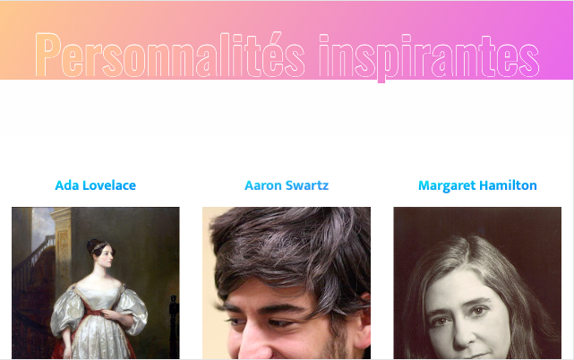

# API_PromoBecode

After 1.5 month of training at becode, this is the first exercice we made with RestAPI.

The aim was to: 
- understand how API works
- set the request
- understand how to process the data received following the request

- set up a style that can dynamically adapt to any API additions / deletions

First exercise imposing the use of Bootstrap for the style.

https://ebialais.github.io/API_PromoBecode/

